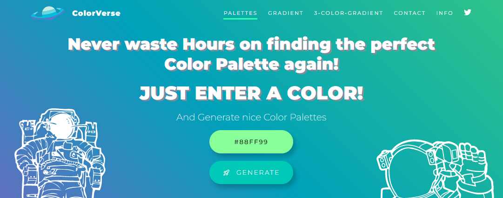
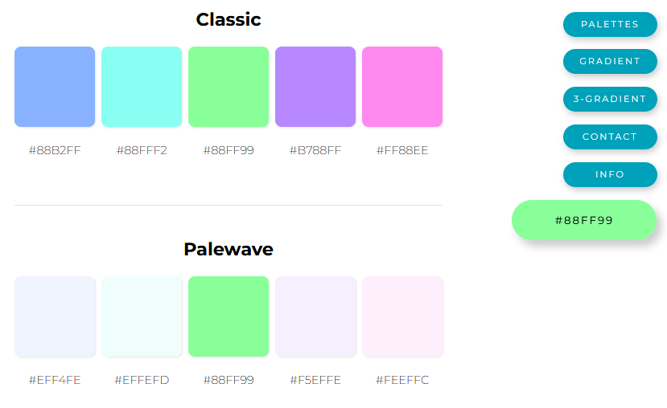
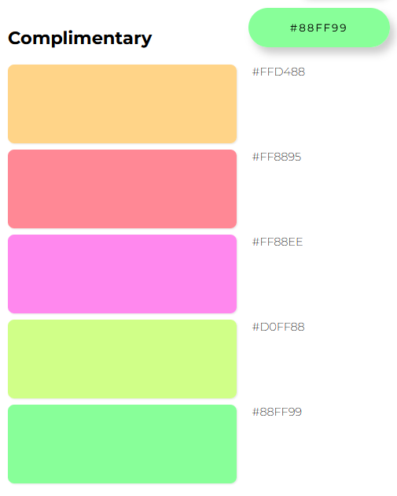

# ColorVerse

## A color palette generator based on https://mycolor.space and built in Svelte.

### Try it out [here!](https://pedantic-jackson-d957bc.netlify.app/)

Type in a hex and receive a set of palettes with hues rotated *just right* to give you attractive palettes for use in your designs.

